# architecture-diagrams-kubeflow-docs-agent

# GSoC 2026: Agentic RAG on Kubeflow — Architecture Diagrams

---

## 1. Overall System Architecture

High-level view showing how all components connect.

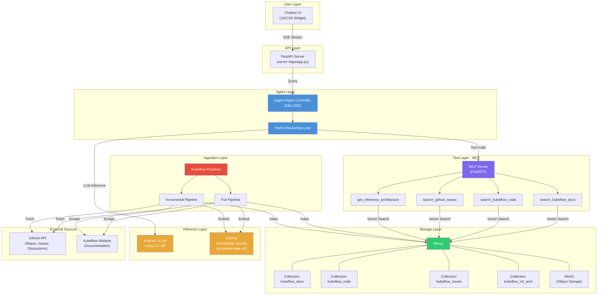

---

## 2. Agentic Architecture — ReAct Reasoning Loop

Shows the multi-step reasoning flow where the agent decides whether to retrieve more, refine, or answer.

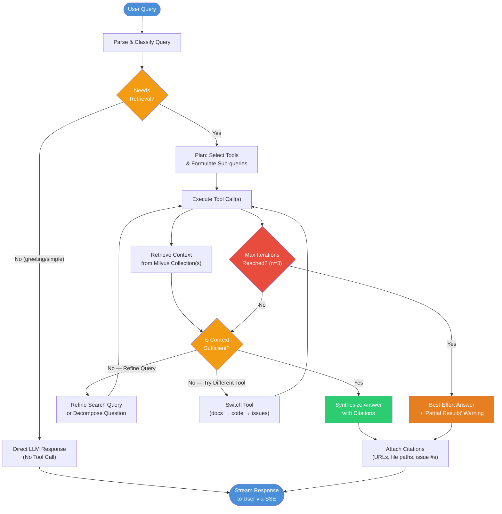

### Sequence Diagram — Multi-Step Query

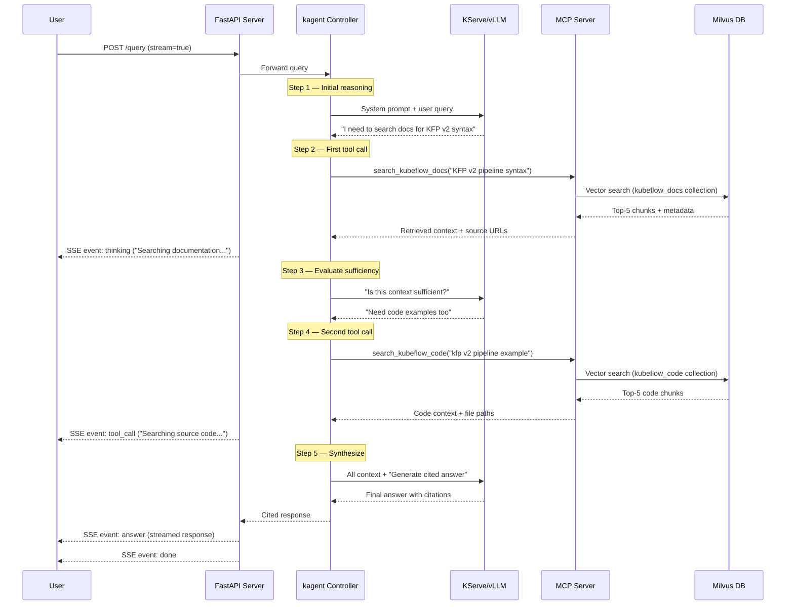

---

## 3. Pluggable Tool Registration Architecture

Shows how new tools can be added without modifying the core agent logic.

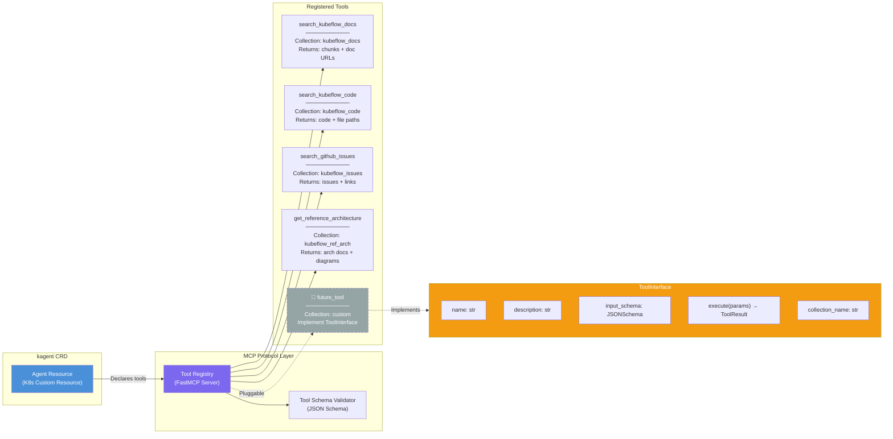

### Tool Registration Flow

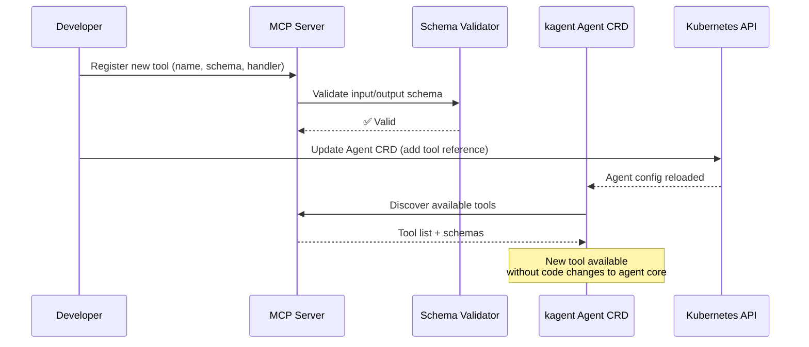

---

## 4. KFP Data Ingestion Pipeline — "Golden Data"

Shows the unified pipeline that handles scraping → cleaning → chunking → embedding → indexing.

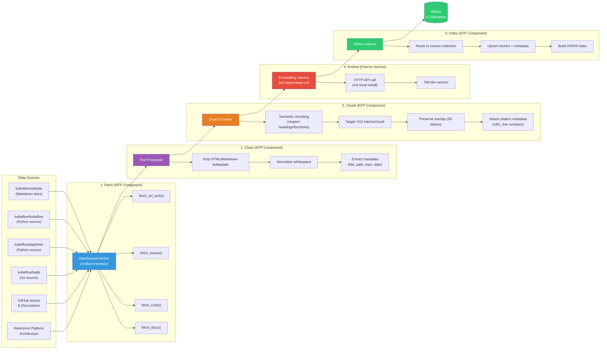

### Full vs Incremental Pipeline

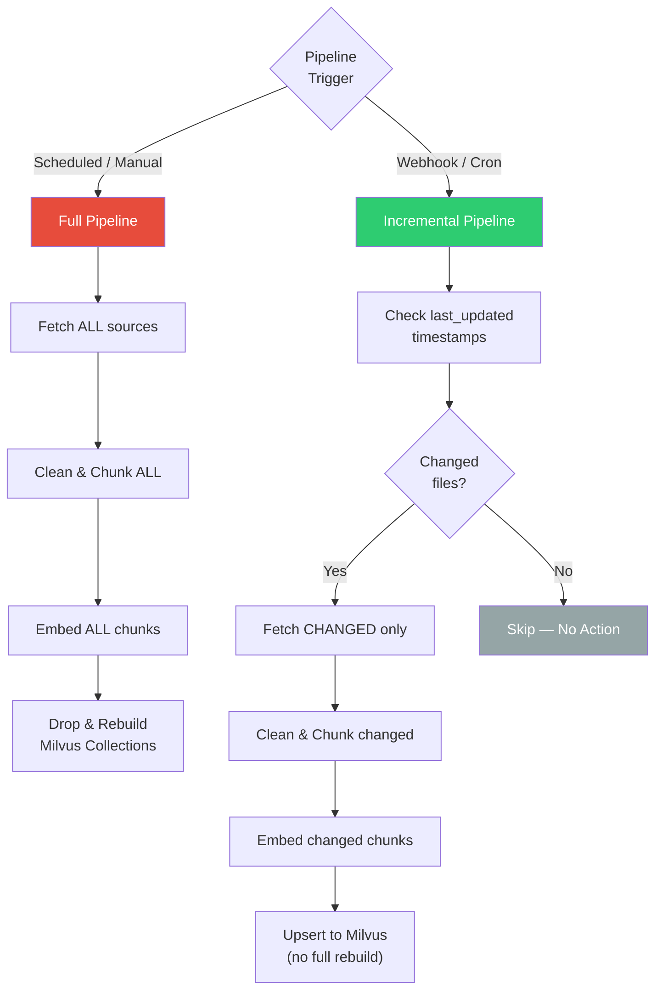

---

## 5. KServe Scale-to-Zero Architecture

Shows how the LLM inference scales down when idle and handles cold starts.

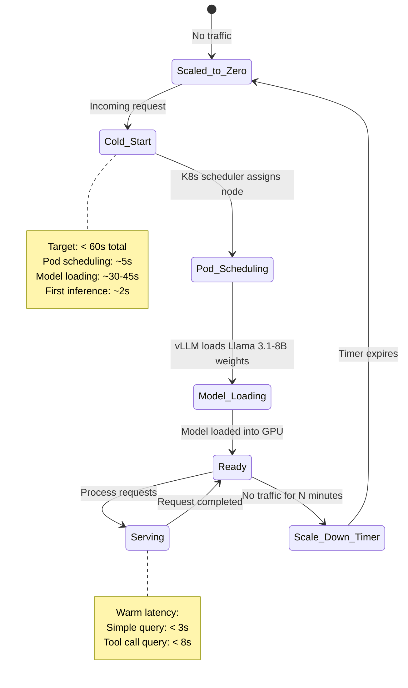

### KServe Component Diagram

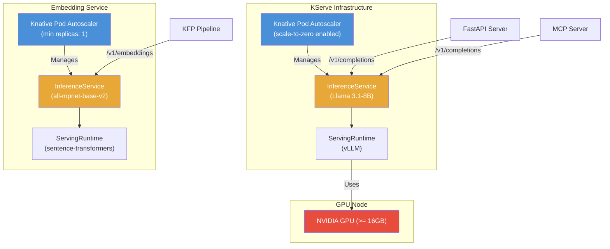

---

## 6. Citation Flow — End-to-End Traceability

Shows how citations are tracked from ingestion through to the final response.

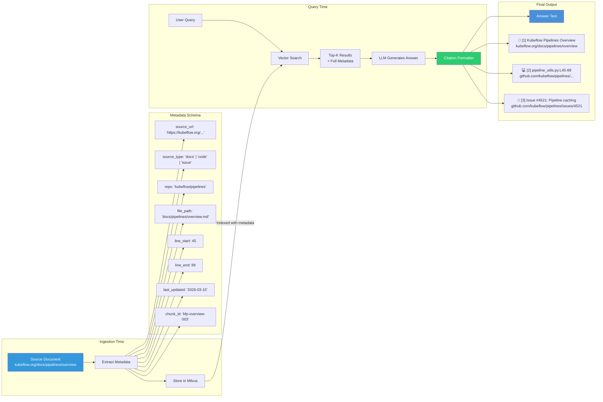

---

## 7. Kubernetes Deployment Topology

Shows where everything runs on the cluster.

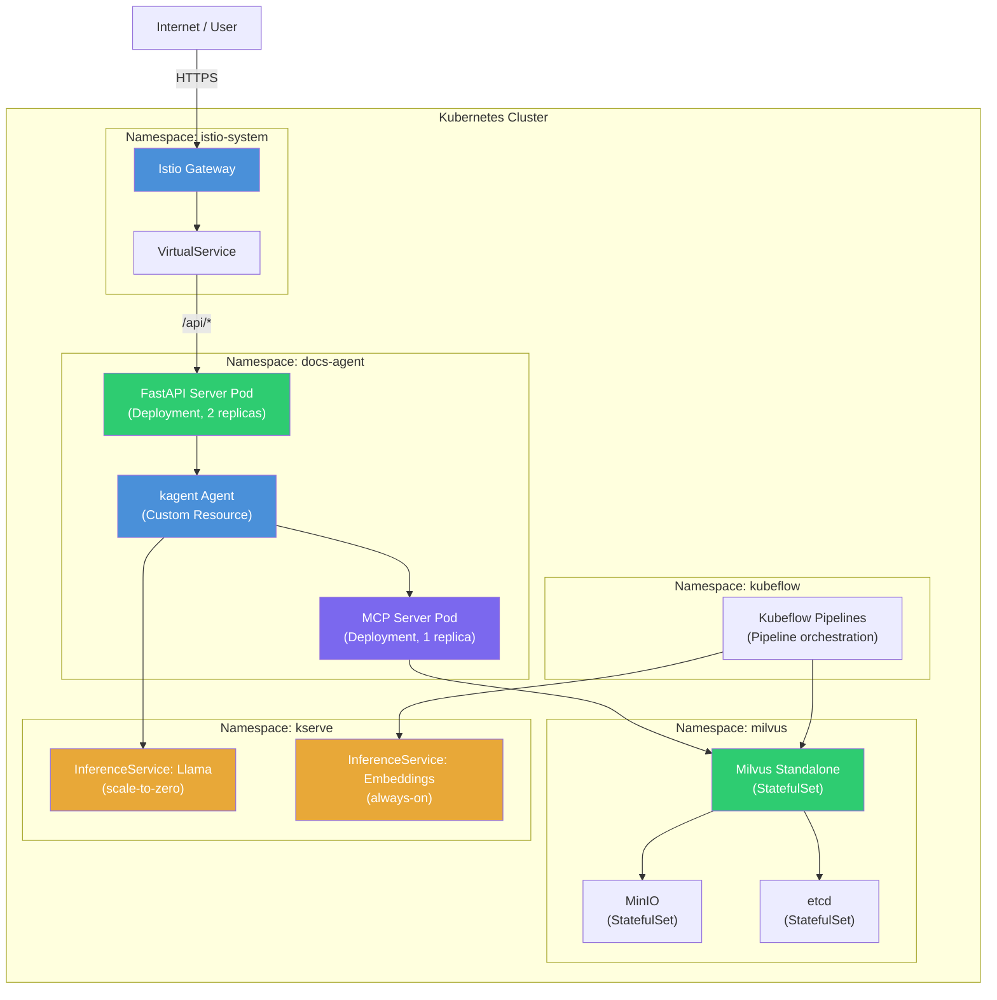
